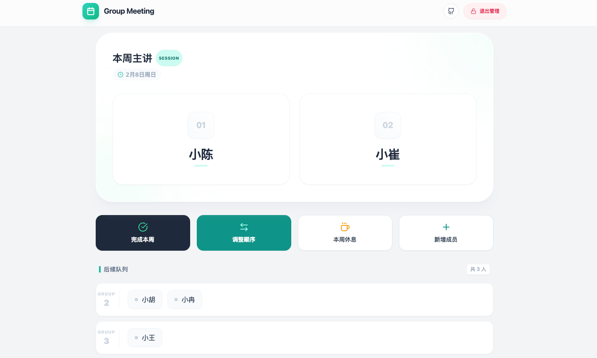

# 📅 Lab Meeting Lite | 学术组会排班助手

轻量、现代、好看好用的科研组会轮值排班系统。支持双人分组、拖拽排序和管理员模式，开箱即用。



## ✨ 特性

- 👥 双人分组：后续队列自动两两分组，贴合常见组会节奏
- 🎨 现代化 UI：清新配色与动效，信息层次清晰
- 🔒 管理员模式：默认密码 `1234`，支持增删改与排序
- 🪄 拖拽与快捷操作：拖拽排序、置顶/置底、交换前两位等常用操作
- ⏭️ 智能流转：一键“完成本周”后，当前两位移至队尾，日期顺延一周
- 💾 轻量持久化：内置本地缓存；可选本地后端，将变更写入 `src/config/data.json`

## 🧱 技术栈

- `React 19` + `Vite 7`
- `Tailwind CSS`（通过 CDN 加载：`https://cdn.tailwindcss.com`）
- 图标：`lucide-react`

## 🚀 快速开始

1. 安装依赖
   ```bash
   npm install
   ```
2. 本地开发
   ```bash
   npm run dev
   ```
3. 生产构建与预览
   ```bash
   npm run build
   npm run preview
   ```

## 🗄️ 数据与持久化

- 初始数据位于 `src/config/data.json`，包含 `members` 与 `meetingDate`
- 默认日期策略：若未指定，自动取“下一个周五”作为组会日期
- 本地缓存键位：
  - 会议日期：`meeting_date_v2`（`localStorage`）
  - 管理员状态：`app_is_admin`（`sessionStorage`）

### 启用本地后端（FastAPI，持久化到文件）

如需在刷新后保留成员顺序与名单，请启动 FastAPI 后端：

```bash
# 安装后端依赖（建议使用虚拟环境）
pip install -r backend/requirements.txt

# 启动服务（默认端口 8000）
uvicorn backend.main:app --host 0.0.0.0 --port 8000
```

后端监听 `POST /api/save-data`，将数据写入 `src/config/data.json`。前端在变更后会自动调用保存接口。

如之前使用了 Node/Express 后端（`server.js`），该文件已不再需要。
已删除 Vite 开发插件与 Node 依赖，避免混乱。

## 端口与地址配置

- 后端端口
  - 默认运行：`uvicorn backend.main:app --host 0.0.0.0 --port 8000`
  - 指定端口示例（改为 9000）：`uvicorn backend.main:app --host 0.0.0.0 --port 9000`
- 前端端口
  - 临时指定端口（改为 3005）：`npm run dev -- --host --port 3005`
  - 或修改默认端口：`vite.config.js` 中 `server.port`
- 前后端地址对齐
  - 前端通过环境变量指定后端地址：编辑 `.env.development`
  - 示例：`VITE_API_BASE=http://localhost:8000`（如果后端改为 9000，则改为 `http://localhost:9000`）
  - 生产环境可在 `.env.production` 中设置同名变量以指向线上后端
 - 域名访问
   - 若通过域名访问前端开发服务器，需在 `vite.config.js` 的 `server.allowedHosts` 中加入你的域名，例如：`['meeting.cuizl.cn']`

## 🧭 使用说明

- 进入管理员模式：点击右上角“管理模式”，输入密码 `1234`
- 完成本周：当前两位主讲移至队尾，日期 +7 天
- 本周休息：仅日期 +7 天，队列顺序保持不变
- 调整顺序：在“调整顺序”弹窗中拖拽，或使用置顶/上移/下移/置底/删除按钮
- 新增成员：管理员模式下，点击“新增成员”并确认

## 🧩 分组与队列规则

- 当前主讲：队首两位
- 后续队列：从第 3 位开始按 2 人一组分组展示

## 📸 自定义与配置

- 修改初始名单与日期：直接编辑 `src/config/data.json`
- Tailwind 通过 CDN 加载，若需离线/自定义构建，可改为本地安装 Tailwind 并配置 PostCSS

## 部署建议

- 纯前端部署：可直接将构建产物部署到任意静态托管平台（如 GitHub Pages、Vercel 等）
- 数据持久化：需要跨刷新保留名单与顺序时，请同时运行本地后端或替换为你的后端服务

## 链接

- GitHub：<https://github.com/CQUPT-CZL/Lab-Meeting-Lite>

## ⚠️ 注意事项

- 管理密码仅用于演示，不适用于公开环境；生产场景请接入真实鉴权方案
- 本地后端默认写入项目内 `src/config/data.json`，请确保有写权限